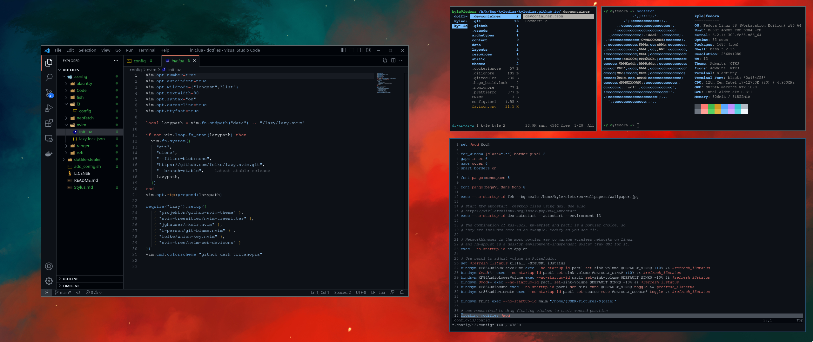
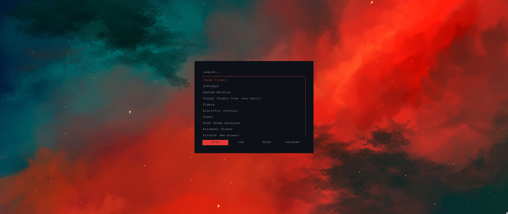
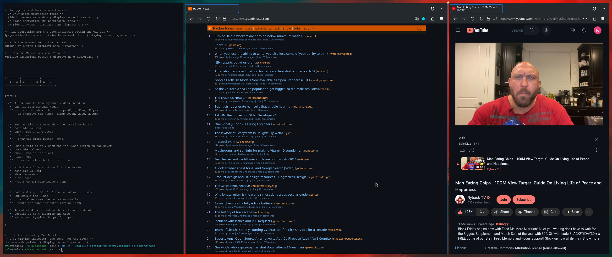

# dotfiles



<details>

<summary>More Images</summary>

</br>





</details>

---

The configration files for my Linux desktop. I don't think it assumes anything about your platform. Everything uses the Github Dark color palette when possible.

## Installation

For Distros with `dnf` only

```bash
./install.sh --dotfiles
```

Reboot and choose i3 at the login screen

### Firefox

* [SimpleFox](https://github.com/migueravila/SimpleFox)
* [Stylus w/ recolored Catppuccin themes](Stylus.md)
* [Dark Reader](https://addons.mozilla.org/en-US/firefox/addon/darkreader/) w/ background `#0d1117` and text `#ecf2f8`

### Docker

I like to excusively use VSCode dev containers to program in order to manage my packages and makr sure my host OS doens't get cluttered with random packages.

* [Install Docker](https://docs.docker.com/engine/install/fedora/)
* [Install Nvidia Container Toolkit](https://docs.nvidia.com/datacenter/cloud-native/container-toolkit/install-guide.html) so docker containers can use GPU

OR

```bash
./install --docker
```

## Things Used

- **Distro**: [fedora i3](https://spins.fedoraproject.org/i3/)
- **Shell**: [fish](https://fishshell.com/)
- **Terminal**: [Alacritty](https://github.com/alacritty/alacritty)
- **Editor**: [Neovim](https://neovim.io/) & VSCode
- **File Manager**: [Ranger](https://github.com/ranger/ranger)
- **Application launcher**: [rofi](https://github.com/davatorium/rofi)